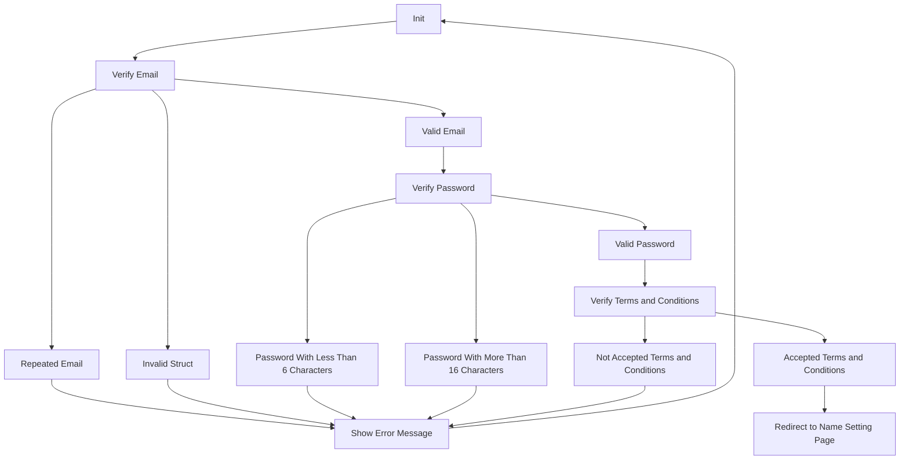
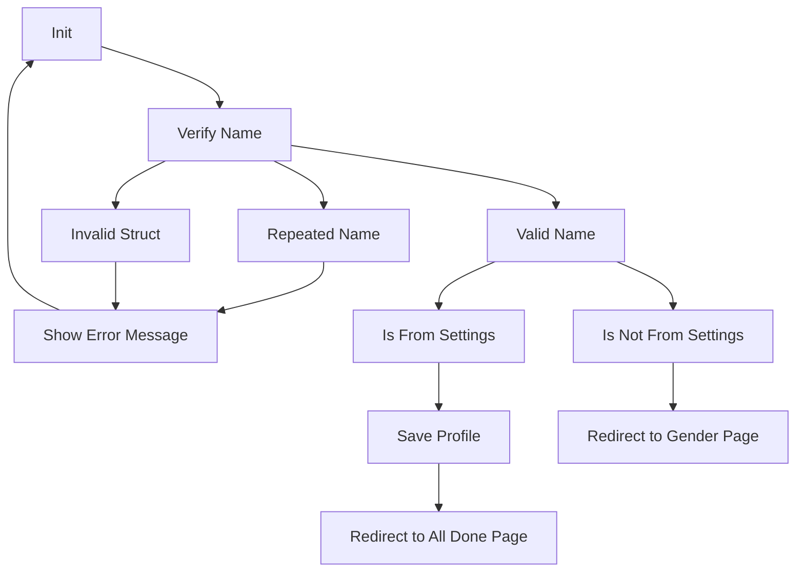
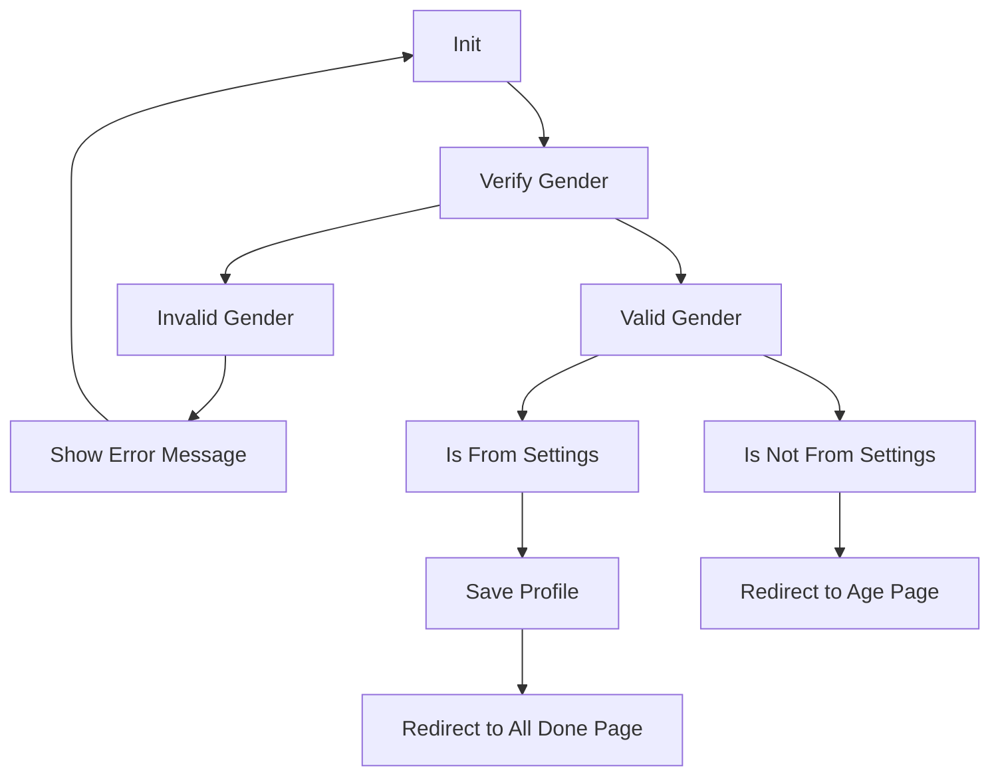
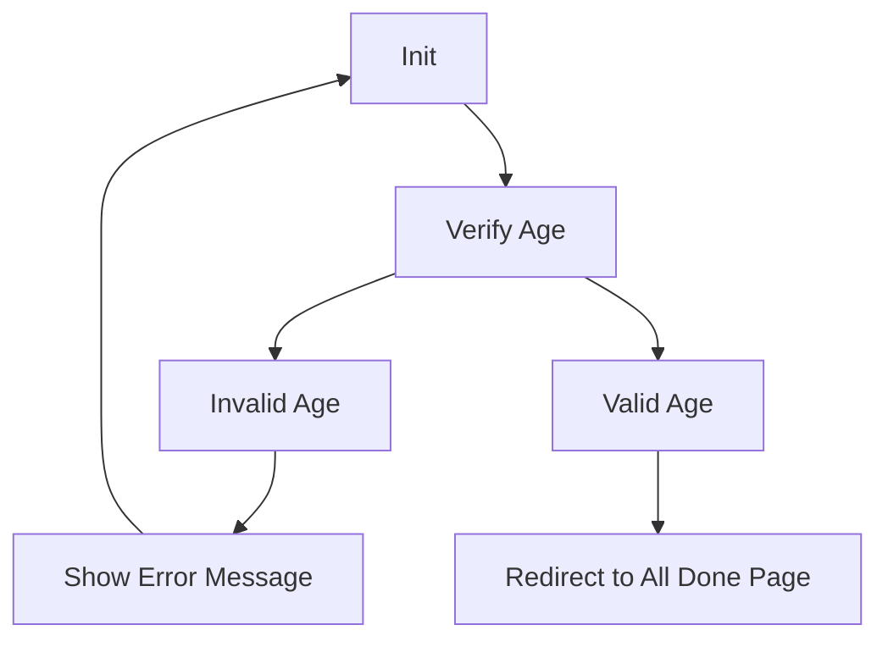
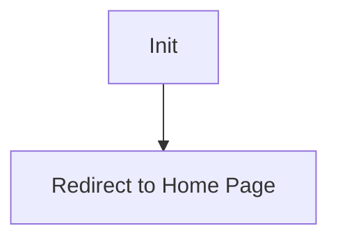

# Sign Up Page Flow

```mermaid
flowchart
    A[Init] --> B[Verify Email]
    B --> C[Repeated Email]
    B --> D[Invalid Struct]
    C --> E
    D --> E[Show Error Message]
    E --> A
    B --> F[Valid Email]
    F --> G[Verify Password]
    G --> H[Password With Less Than 6 Characters]
    G --> I[Password With More Than 16 Characters]
    H --> E
    I --> E
    G --> J[Valid Password]
    J --> K[Verify Terms and Conditions]
    K --> L[Not Accepted Terms and Conditions]
    K --> N[Accepted Terms and Conditions]
    N --> O[Redirect to Name Setting Page]
    L --> E
```
# Name Setting Page Flow

```mermaid
flowchart
    A[Init] --> B[Verify Name]
    B --> C[Repeated Name]
    B --> D[Invalid Struct]
    C --> F[Show Error Message]
    D --> F
    F --> A
    B --> G[Valid Name]
    G --> H[Is From Settings]
    H --> I[Save Profile]
    I --> J[Redirect to All Done Page]
    G --> K[Is Not From Settings]
    K --> L[Redirect to Gender Page]
```

# Gender Page Flow

```mermaid
flowchart
    A[Init] --> B[Verify Gender]
    B --> C[Invalid Gender]
    C --> D[Show Error Message]
    D --> A
    B --> E[Valid Gender]
    E --> F[Is From Settings]
    F --> G[Save Profile]
    G --> H[Redirect to All Done Page]
    E --> I[Is Not From Settings]
    I --> J[Redirect to Age Page]
```

# Age Page Flow

```mermaid
flowchart
    A[Init] --> B[Verify Age]
    B --> C[Invalid Age]
    C --> D[Show Error Message]
    D --> A
    B --> E[Valid Age]
    E --> F[Redirect to All Done Page]
```

# All Done Page Flow

```mermaid
flowchart
    A[Init] --> B[Redirect to Home Page]
```