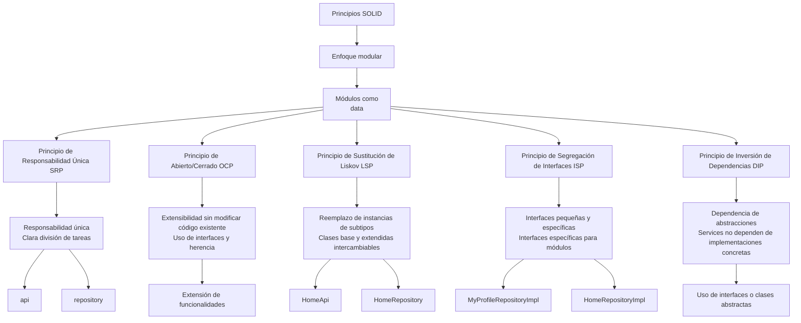

```mermaid
graph TD
    A[Principios SOLID] --> B[Enfoque modular]
    B --> C[Módulos como<br>data]

    %% SRP
    C --> D1[Principio de Responsabilidad Única SRP]
    D1 --> E1[Responsabilidad única<br>Clara división de tareas]
    E1 --> F1[api]
    E1 --> F2[repository]

    %% OCP
    C --> D2[Principio de Abierto/Cerrado OCP]
    D2 --> E2[Extensibilidad sin modificar código existente<br>Uso de interfaces y herencia]
    E2 --> F3[Extensión de funcionalidades]

    %% LSP
    C --> D3[Principio de Sustitución de Liskov LSP]
    D3 --> E3[Reemplazo de instancias de subtipos<br>Clases base y extendidas intercambiables]
    E3 --> F4[HomeApi]
    E3 --> F5[HomeRepository]

    %% ISP
    C --> D4[Principio de Segregación de Interfaces ISP]
    D4 --> E4[Interfaces pequeñas y específicas<br>Interfaces específicas para módulos]
    E4 --> F6[MyProfileRepositoryImpl]
    E4 --> F7[HomeRepositoryImpl]

    %% DIP
    C --> D5[Principio de Inversión de Dependencias DIP]
    D5 --> E5[Dependencia de abstracciones<br>Services no dependen de implementaciones concretas]
    E5 --> F8[Uso de interfaces o clases abstractas]

    %% Styling (opcional)
    class A,B,C,D1,D2,D3,D4,D5,E1,E2,E3,E4,E5,F1,F2,F3,F4,F5,F6,F7,F8 purple;
```