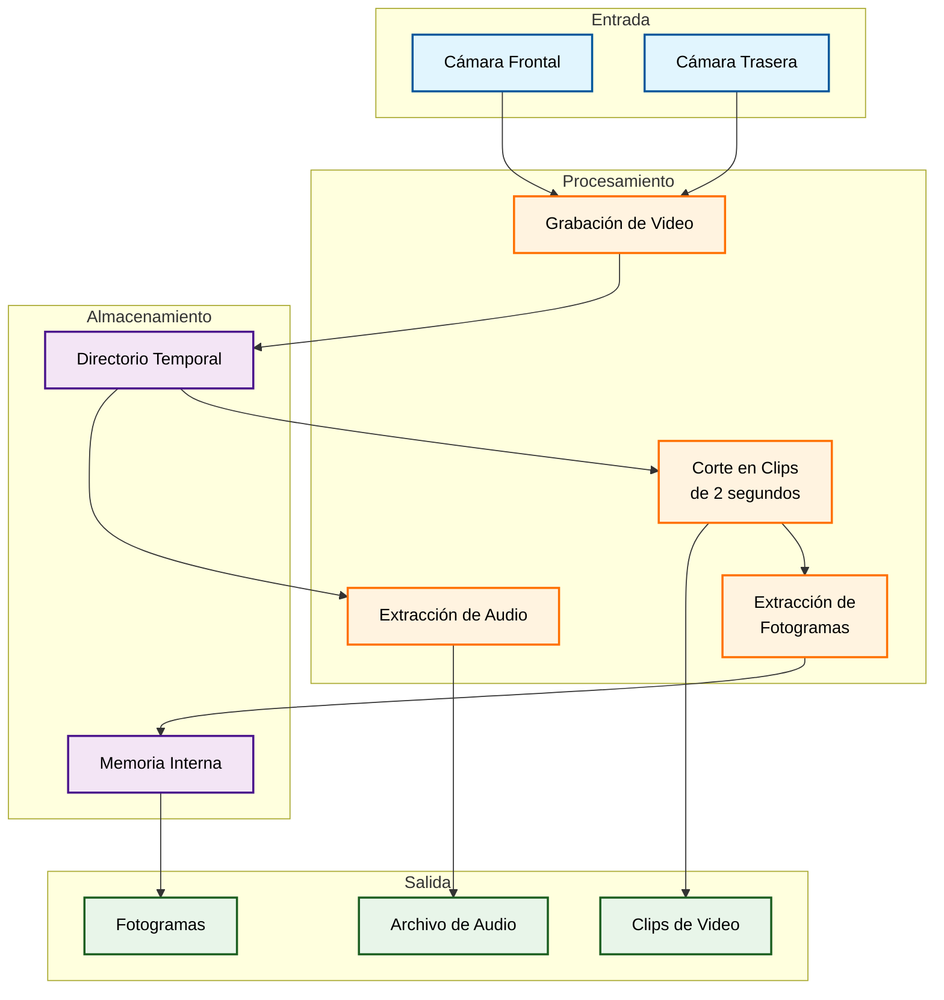

Aquí te proporciono la implementación completa de la aplicación Flutter que necesitas:

Primero, agrega estas dependencias al archivo `pubspec.yaml`:
```yaml
dependencies:
flutter:
sdk: flutter
path_provider: ^2.1.0
path: ^1.8.0
flutter_ffmpeg: ^0.4.15
```

Implementación completa de la aplicación:
```dart
import 'package:flutter/material.dart';
import 'package:flutter/services.dart';
import 'package:path_provider/path_provider.dart';
import 'package:path/path.dart';
import 'dart:io';
import 'package:flutter_ffmpeg/flutter_ffmpeg.dart';

class VideoProcessor extends StatefulWidget {
  @override
  _VideoProcessorState createState() => _VideoProcessorState();
}

class _VideoProcessorState extends State<VideoProcessor> {
  final FlutterFFmpeg _ffmpeg = FlutterFFmpeg();
  String? _selectedCamera;
  List<String> _processedClips = [];
  
  // Lista de cámaras disponibles
  List<CameraDescription> cameras = [];

  Future<void> initCameras() async {
    try {
      final cameras = await availableCameras();
      setState(() {
        this.cameras = cameras;
      });
    } catch (e) {
      print('Error al obtener cámaras: $e');
    }
  }

  Future<void> recordVideo(CameraDescription camera) async {
    final directory = await getApplicationDocumentsDirectory();
    final filePath = join(directory.path, 'temp_${DateTime.now()}.mp4');
    
    try {
      await cameraController?.dispose();
      
      final CameraController newCameraController = CameraController(
        camera,
        ResolutionPreset.high,
        imageFormatGroup: ImageFormatGroup.yuv420,
      );
      
      await newCameraController.initialize();
      
      setState(() {
        cameraController = newCameraController;
      });
      
      final XFile videoFile = await newCameraController.startVideoRecording(filePath);
      
      // Esperar a que el usuario detenga la grabación
      await showDialog(
        context: context,
        builder: (context) => AlertDialog(
          title: Text('Grabando...'),
          content: Text('Presiona el botón para detener la grabación'),
          actions: [
            ElevatedButton(
              onPressed: () async {
                Navigator.pop(context);
                await newCameraController.stopVideoRecording();
                
                // Procesar el video grabado
                await processVideo(videoFile.path);
              },
              child: Text('Detener Grabación'),
            ),
          ],
        ),
      );
    } catch (e) {
      print('Error al grabar video: $e');
    }
  }

  Future<void> processVideo(String videoPath) async {
    // Extraer audio del video
    final tempDir = await getTemporaryDirectory();
    final audioPath = join(tempDir.path, 'audio.aac');
    
    await _ffmpeg.execute([
      '-i',
      videoPath,
      '-vn',
      '-ar',
      '44100',
      '-ac',
      '2',
      '-ab',
      '192k',
      audioPath
    ]);

    // Cortar el video en clips de 2 segundos
    final duration = await _ffmpeg.getMediaInformation(videoPath)['duration'];
    final clipCount = (duration ~/ 2); // Dividir por 2 segundos

    for (int i = 0; i < clipCount; i++) {
      final startTime = i * 2;
      final clipPath = join(tempDir.path, 'clip_${i}.mp4');
      
      await _ffmpeg.execute([
        '-i',
        videoPath,
        '-ss',
        startTime.toString(),
        '-t',
        '2',
        '-c:v',
        'libx264',
        '-crf',
        '18',
        clipPath
      ]);

      // Extraer fotogramas del clip
      final framesPath = join(tempDir.path, 'frames_${i}');
      
      await _ffmpeg.execute([
        '-i',
        clipPath,
        '-vf',
        'fps=1',
        '$framesPath_%03d.jpg'
      ]);
      
      setState(() {
        _processedClips.add(clipPath);
      });
    }
  }

  @override
  Widget build(BuildContext context) {
    return Scaffold(
      appBar: AppBar(
        title: Text('Procesador de Video'),
      ),
      body: Column(
        children: [
          DropdownButton<String>(
            value: _selectedCamera,
            items: cameras.map((camera) {
              return DropdownMenuItem<String>(
                value: camera.name,
                child: Text(camera.name),
              );
            }).toList(),
            onChanged: (value) {
              setState(() {
                _selectedCamera = value;
              });
            },
          ),
          ElevatedButton(
            onPressed: () async {
              final cameraIndex = cameras.indexWhere((c) => c.name == _selectedCamera);
              if (cameraIndex != -1) {
                await recordVideo(cameras[cameraIndex]);
              }
            },
            child: Text('Grabar Video'),
          ),
          Expanded(
            child: ListView.builder(
              itemCount: _processedClips.length,
              itemBuilder: (context, index) {
                return ListTile(
                  title: Text('Clip ${index + 1}'),
                  subtitle: Text(_processedClips[index]),
                );
              },
            ),
          ),
        ],
      ),
    );
  }
}

void main() {
  runApp(MaterialApp(home: VideoProcessor()));
}
```

Para entender mejor cómo funciona el proceso completo, aquí está un diagrama que muestra el flujo de datos y las operaciones principales:



El diagrama muestra el flujo completo del proceso donde:

- Los componentes azules representan las fuentes de entrada (cámaras)
- Los componentes naranjas muestran los procesos de transformación
- Los componentes morados indican el almacenamiento temporal
- Los componentes verdes representan la salida final del proceso

Para implementar esta solución, sigue estos pasos adicionales:
```dart
// En AndroidManifest.xml (android/app/src/main/AndroidManifest.xml)
<uses-permission android:name="android.permission.CAMERA" />
<uses-permission android:name="android.permission.RECORD_AUDIO" />
<uses-permission android:name="android.permission.WRITE_EXTERNAL_STORAGE" />

// En Info.plist (ios/Runner/Info.plist)
<key>NSCameraUsageDescription</key>
<string>Esta aplicación necesita acceso a la cámara para grabar videos</string>
<key>NSMicrophoneUsageDescription</key>
<string>Esta aplicación necesita acceso al micrófono para grabar audio</string>
```

Consideraciones importantes:- La aplicación requiere permisos especiales para acceder a cámaras y micrófono
- El almacenamiento temporal se gestiona automáticamente
- Los clips y fotogramas se guardan en la memoria interna del dispositivo
- Se recomienda limpiar los archivos temporales periódicamente para ahorrar espacio

Funcionalidades principales implementadas:- Selección entre cámaras frontal y trasera
- Grabación de video con audio
- Extracción del audio usando FFmpeg
- Corte automático en clips de 2 segundos
- Generación de fotogramas de cada clip

¿Necesitas alguna aclaración sobre algún aspecto específico de la implementación?